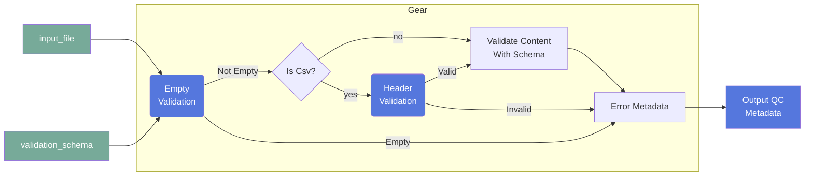

# file-validator (File Validator)

## Overview

This gear is used to validate files content, Flywheel file metadata
or Flywheel container metadata according to a user provided
JSONSchema file. It can be run at the project, subject, session or acquisition level.

### Summary

Validates a json or csv file based on a provided validation schema

### License

*License:* MIT

### Classification

*Category:* utility

*Gear Level:*

- [X] Project
- [X] Subject
- [X] Session
- [X] Acquisition
- [ ] Analysis

----

[[_TOC_]]

----

### Inputs

- *input_file*
    - __Name__: *input_file*
    - __Type__: *file*
    - __Optional__: *true*
    - __Description__: *The file to validate. If none is provided, only the destination
      container metadata will be validated*
- *validation_schema*:
    - __Name__: *validation_schema*
    - __Type__: *file*
    - __Optional__: *false*
    - __Description__: *The JSONSchema to use to validate the file and/or container
      metadata*

### Config

- *validation_level*
    - __Name__: *validation_level*
    - __Type__: *string*
    - __Description__: *Select if validation should run on the file or the flywheel
      representation of the file.  'Validate File Contents' will read the input file and
      run validation on it, 'Validate Flywheel Objects' will load the json
      representation of the file in flywheel, including the parent container objects of
      the file*
    - __Default__: *Validate File Contents*
    - __Choices__: *['Validate File Contents', 'Validate Flywheel Objects']*

- *add_parents*:
    - __Name__: *add_parents*
    - __Type__: *boolean*
    - __Description__: *If validating Flywheel Objects, add the parent containers of the object to the schema for validation*
    - __Default__: *false*
  
  - *tag*:
    - __Name__: *tag*
    - __Type__: *string*
    - __Description__: *Tag to attach to files that gear runs on upon run completion*

  - *debug*: 
    - __Name__: *debug*
    - __Type__: *boolean*
    - __Description__: *Tag to attach to files that gear runs on upon run completion*
    - __Default__: *false*

### Outputs

#### Files

none

#### Metadata

Any schema errors identified by the gear will be stored on the file's metadata.
The over-all pass/fail state of the validation will also be stored.

The metadata will be added to the file or container under the file
custom information in the following format:

```yaml
qc:
  file-validator:
    validation:
      state: "PASS"   # or "FAIL" depending on the file validation
      data: [ "<list of error objects>" ]
```

where each error object has the following keys:

```json
{
  "type": "str - will always be 'error' in this gear",
  "code": "str - Type of the error (e.g. MaxLength)",
  "location": "<location object>",
  "flywheel_path": "str – Flywheel path to the container/file",
  "container_id": "str – ID of the source container/file ",
  "value": "str – current value",
  "expected": "str – expected value",
  "message": "str – error message description" 
 }
```


Where value for location will be formatted as such:

For JSON input file:

```
{ “key_path”: "str = the json key that raised the error" }
```

For CSV input file:

```
{ “line”: "int - the row number that raised the error", 
“column_name”: "str - the column name that raised the error" }
```


### Pre-requisites

When validating Flywheel file metadata, file content first need to be parsed. The
[`form-importer`](https://gitlab.com/flywheel-io/scientific-solutions/gears/form-importer)
gear can be used to parse the file content and add it to the file metadata.

## Usage

### Description

This gear can be used to validate different file content and extracted file metadata
against a JSONSchema. The JSONSchema file can be provided as a gear input and much
easier describe the content of the file or the metadata of the file and optionally
its parent container. The gear can be triggered automatically through gear rule
when configured as such or be used as part of a validation pipeline.

**Supported Filetypes**: Json, Csv.

#### Validation steps:

##### JSON:
For a json file there are two validation checks that are done:
1. Empty File Validation - checks to see if the file is empty
2. Schema validation - applies the schema directly to the file

##### CSV:
For a csv file, two validation checks are performed:
1. Empty File Validation - checks to see if the file is empty.
2. Header Validation - Checks to see that a header is present, AND if the header 
has any extra columns NOT specified in the schema.
3. Schema Validation - Each row is turned into a json object with
`key:value` pairs, where the key comes from the column headers, and the values
come from the cells in the given row.  Each row is then validated against the
schema.


#### File Specifications

This section contains specifications on any input files that the gear may need

##### *input_file*

The input file content or metadata extracted from the file will be validated against
against the JSONSchema

##### *validation_schema*

The JSONSchema to use to validate the file and/or container metadata must be provided
as a gear input and much easier describe the content of the file or the metadata 
extracted. The file content must be a valid JSON following the [JSONSchema](https://json-schema.org/) standard.

For example, if the `input_file` is a JSON with the following content:

```json
{
    "KeyA": "Some-Value"
}
```
and the following JSONSchema is used:

```json
{
  "$schema": "http://json-schema.org/draft-07/schema",
  "$comment": "JSON Schema for my file",
  "$id": "MyID",
  "title": "MyTitle",
  "type": "object",
  "required": ["MyKey"],
  "definitions": {
    "MyKey": {
      "type": "string",
      "maxLength": 4
    }
  },
  "properties": {
    "MyKey": {
      "$ref": "#/definitions/MyKey"
    }
  }
}
```

The gear will validate the content of the `input_file` and generates a report 
of any validation errors it finds.  The report is saved on the metadata.


### Workflow




## Contributing

[For more information about how to get started contributing to that gear,
checkout [CONTRIBUTING.md](CONTRIBUTING.md).]
<!-- markdownlint-disable-file -->
