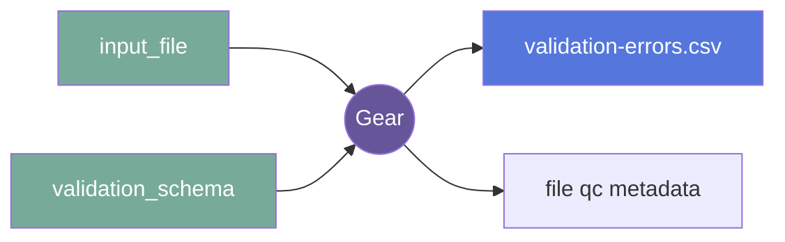

# file-validator (File Validator)

## Overview

This gear is used to validate files content, Flywheel file metadata
or Flywheel container metadata according to a user provided
JSONSchema file. It can be run at the project, subject, session or acquisition level.

### Summary

Validates a file based on a provided validation schema

### License

*License:* MIT

### Classification

*Category:* utility

*Gear Level:*

- [X] Project
- [X] Subject
- [X] Session
- [X] Acquisition
- [ ] Analysis

----

[[_TOC_]]

----

### Inputs

- *input_file*
    - __Name__: *input_file*
    - __Type__: *file*
    - __Optional__: *true*
    - __Description__: *The file to validate. If none is provided, only the destination
      container metadata will be validated*
- *validation_schema*:
    - __Name__: *validation_schema*
    - __Type__: *file*
    - __Optional__: *false*
    - __Description__: *The JSONSchema to use to validate the file and/or container
      metadata*

### Config

- *validation_level*
    - __Name__: *validation_level*
    - __Type__: *string*
    - __Description__: *Select if validation should run on the file or the flywheel
      representation of the file.  'Validate File Contents' will read the input file and
      run validation on it, 'Validate Flywheel Objects' will load the json
      representation of the file in flywheel, including the parent container objects of
      the file*
    - __Default__: *Validate File Contents*
    - __Choices__: *['Validate File Contents', 'Validate Flywheel Objects']*

- *add_parents*:
    - __Name__: *add_parents*
    - __Type__: *boolean*
    - __Description__: *If validating Flywheel Objects, add the parent containers of the object to the schema for validation*
    - __Default__: *false*
  
  - *tag*:
    - __Name__: *tag*
    - __Type__: *string*
    - __Description__: *Tag to attach to files that gear runs on upon run completion*

  - *debug*: 
    - __Name__: *debug*
    - __Type__: *boolean*
    - __Description__: *Tag to attach to files that gear runs on upon run completion*
    - __Default__: *false*

### Outputs

#### Files

- *{Output-File}*
    - __Name__: *{input file name}-validation-errors.csv*
    - __Type__: *file*
    - __Optional__: *True*
    - __Description__: *A CSV file containing the JSONSchema error found*

The CSV file will contain the JSONSchema validation errors found, each row 
corresponding to a unique error found. The columns are:

* `Error_type`: The JSONSchema error type
* `Error_location`: The key in the input_file where the error was found
* `Value`: The value of the key in the input_file where the error was found
* `Expected`: The expected value of the key in the input_file where the error was found
* `Message`: The error message
* `Flywheel_Path`: The Flywheel path to the file
* `Container_ID`: The Flywheel ID of the container containing the file


#### Metadata

The gear will add the following metadata to the file or container under the file
custom information:

```yaml
qc:
  file-validator:
    validation:
      state": "PASS"   # or "FAIL" depending on the file validation
```

### Pre-requisites

When validating Flywheel file metadata, file content first need to be parsed. The
[`form-importer`](https://gitlab.com/flywheel-io/scientific-solutions/gears/form-importer)
gear can be used to parse the file content and add it to the file metadata.

## Usage

### Description

This gear can be used to validate different file content and extracted file metadata
against a JSONSchema. The JSONSchema file can be provided as a gear input and much
easier describe the content of the file or the metadata of the file and optionally
its parent container. The gear can be triggered automatically through gear rule
when configured as such or be used as part of a validation pipeline.

#### File Specifications

This section contains specifications on any input files that the gear may need

##### *input_file*

The input file content or metadata extracted from the file will be validated against
against the JSONSchema

##### *validation_schema*

The JSONSchema to use to validate the file and/or container metadata must be provided
as a gear input and much easier describe the content of the file or the metadata 
extracted. The file content must be a valid JSON following the [JSONSchema](https://json-schema.org/) standard.

For example, if the `input_file` is a JSON with the following content:

```json
{
    "KeyA": "Some-Value"
}
```
and the following JSONSchema is used:

```json
{
  "$schema": "http://json-schema.org/draft-07/schema",
  "$comment": "JSON Schema for my file",
  "$id": "MyID",
  "title": "MyTitle",
  "type": "object",
  "required": ["MyKey"],
  "definitions": {
    "MyKey": {
      "type": "string",
      "maxLength": 4
    }
  },
  "properties": {
    "MyKey": {
      "$ref": "#/definitions/MyKey"
    }
  }
}
```

The gear will validate the content of the `input_file` and reports any valiation error
found in the `{input file name}-validation-errors.csv` file. In this case, 
the CSV file will contain a single validation error:


|Error_Type | Error_Location | Value | Expected | Message | Flywheel_Path | Container_ID"
|-----------|----------------|-------|----------|---------|---------------|-------------"
|maxLength  | MyKey | Some-Value | "{'type': 'string', 'maxLength': 4}" | 'Some-Value' is too long | fw://nicolas/dumpster/file-validator/file-validator/test/test.json | 656ec1611b428ce88b11d303"


### Workflow



An overview/orientation of the logging and how to interpret it.

## Contributing

[For more information about how to get started contributing to that gear,
checkout [CONTRIBUTING.md](CONTRIBUTING.md).]
<!-- markdownlint-disable-file -->
